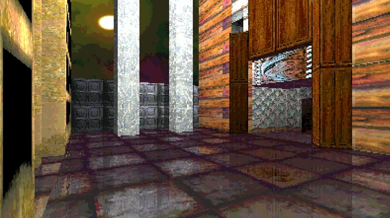
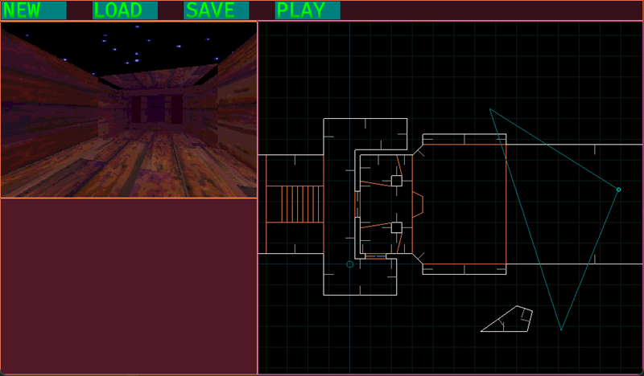

2.5 Dimensional Software Render and Game imitating Ken Silverman's Build Engine.

Custom Rendering and Physics
Uses LibGDX for basic window setup, input, and other miscellaneous things.

Requires Lightweight Java Game Library to build.

  
  

